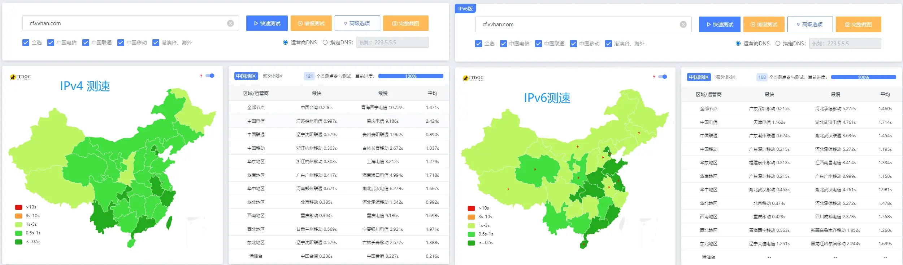

# CloudflareIP-dnspod-ddns

Cloudflare 优选 IP，并通过 dnspod 自动切换，15 分钟更新一次

### 1.自行部署

> 在 DNSPod 中添加子域名的 Ipv4 和 Ipv6 解析记录后,可开启脚本

### 2.使用现有服务

> 博主维护的公共 `CNAME` 域名：`*.cf.cname.vvhan.com`， 同时支持 `IPv4` 和 `IPv6`.

> 公共 `CNAME` 可能会将搜索引擎蜘蛛线路解析到其他服务器来劫持蜘蛛。因此我们可以自定义 CNAME 地址来避免这种情况的发生.

> 例如：`自定义.cf.cname.vvhan.com` 自定义 为 `xixi-haha` 解析 `xixi-haha.cf.cname.vvhan.com.` 即可

### 3.自动更新

> 脚本以 `Server` 服务的方式运行，默认每隔 `15` 分钟自动更新也可手动访问 `http://localhost:3000/updateCloudflareIp` 手动更新

### 测速

优选 IP 示例站点： https://cf.vvhan.com

